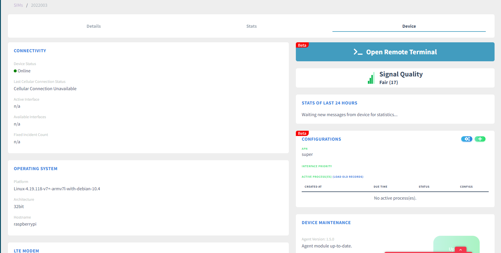

# Guide for Sensor Assembly, Programming, and Test

## 1. Hardware Assembly
Materials:
Number | Material | Count | Note
:--:|:--|:--:|:--:
A1 | Raspberry Pi 3 | 1 | 
A2 | Witty Pi 3 Set | 1 | 
A3 | Waveshare ADC Board | 1 | 
A4 | LTE Base | 1 | 
A5 | LTE Module | 1 | 
A6 | LTE Full Band Antenna | 1 | 
A7 | LTE GNSS Dual Antenna | 1 | 
A8 | Sixfab SIM | 1 | 
A9 | Temperature Sensor | 1 |
B1 | M2.5 5mm standoff M-F| 4 | 
B2 | M2.5 11mm standoff F-F| 4 | 
B3 | M2.5 13mm standoff M-F| 2 | Plan B: 5mm x2 + Nut x2 
B4 | M2.5 Screw| 4 |

### 1.1 Base Level
Fix A1 by 4 B1 at bottom, and 4 B2 at top. 

### 1.2 Mid Level
Insert battery, remove pin P0 on Witty Pi, fix A2 by 2 B4 and 2 B3.

### 1.3 Top Level
Romove original hat and install individual hats on pins of the temperature sensor.

Install A3 on A2, fix it with 2 B4, and make sure "AINCOM-AGND", "VCC-3V3", "VREF-3V3" are connected by yellow hat as shown in green circle. Then install temperature sensor, connect data to P29, GND to GND, VCC to 5V.

### 1.4 LTE Level
Install A5 on A4. Record account number of A8, then install A8 on A4. Install A6 on A5 connected to "DIV". Install A7 on A5, with GPS connected to "GNSS", LTE connected to "MAIN". Don't connect LTE board with other boards for now.

## 2. Programming and Test
### 2.1 Write system to SD card
Open "Win32 Disk Imager", choose lastest image file, select SD card device path, then click "write".

### 2.2 Login system by SSH
Build a local 2.4G wifi network with SSID "test", password "00000000".

Insert SD card in A1, connect power to A2, press power button on A2, device with connected to WIFI automatically.

Login system remotely by SSH, using "ssh [user name]@[IP address]", input passward.

### 2.3 Intial Sixfab

Update system software source by "sudo apt update -y".

Register SIM card sequence on "https://connect.sixfab.com", choose "SIM"-"Register a SIM", input ICCID and device number, then click "register".

Find the record in SIMs list, click "show details".

Chose "Device", "Global", "Raspberry Pi", then click "copy".

Paste the code to SSH.

Execute the code, sixfab core will be installed, by now, keep LTE board apart from main board.

After finish.

Disconnect power

### 2.4 Network test
Connect LTE board to arbitrary usb pord on A1, active SIM card on SixFab, then connect power to A1.

Wait for minutes, check "device" on Sixfab, and the device will be registered already.

Turn off test WIFI, reboot to see if LTE works well. Test if "Open Remote Terminal" works well, check if data of sensor "2020000" on PowerHV is updated.

### 2.5 Edit device id
Turn on test WIFI, login by SSH, edit "work/id", change device id

### 2.6 Power management test

Disconnect power, connect power to A2, login by SSH, execute "work/wittypi/wittyPi.sh".

Execute 3 to synchronize time, then 6-4 to set auto reboot. Then wait to see if it works.
